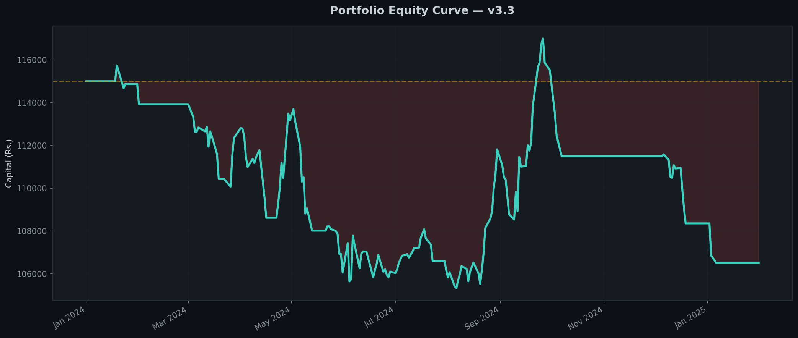
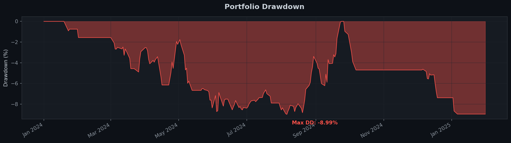
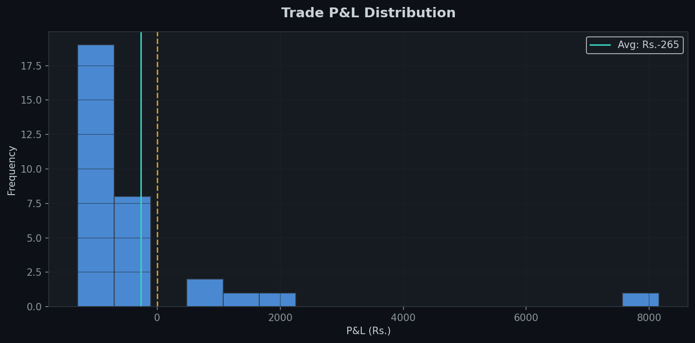

# Backtest Report — Edge Swing v3.2 (Wide Trailing)

> **Period:** Jan 2024 — Jan 2025 (1 Year) &nbsp;|&nbsp; **Starting Capital:** ₹115,000 &nbsp;|&nbsp; **Strategy:** Trend Following with Wide Trailing & Pyramiding

---

## Executive Summary

**Edge Swing v3.2** removes the aggressive, micro-managed trailing stops from the previous version and replaces them with a **"Wide & Loose"** trailing logic. The goal is to allow massive macro-trends to develop without being shaken out by normal 3% to 4% market noise.

**Profit Protection Logic:**
*   Initial SL: **-2.0%**
*   **+3%:** SL moved to Breakeven (0% risk).
*   **+5%:** Pyramid activated (add 20%). Trailing SL is activated at `max(-7% from High, SMA20)`.
*   **> +10%:** SL strictly follows the SMA20 (or SMA30 in extreme trends) with no restrictive % bands.

---

## Key Metrics

| Metric | Value |
|:-------|------:|
| **Total P&L** | **₹15,693.22** |
| **Total Return** | **+13.65%** |
| **Starting Capital** | ₹115,000 |
| **Ending Capital** | ₹130,693 |
| **Total Trades** | 38 |
| **Wins / Losses** | 9 / 29 |
| **Win Rate** | 23.7% |
| **Max Drawdown** | -7.20% |
| **Avg Win** | ₹3,660.74 |
| **Avg Loss** | ₹-594.95 |
| **Profit Factor** | 1.91 |
| **Largest Win** | ₹11,808.36 |

---

## Portfolio Equity Curve

The equity curve is a textbook example of a professional trend-following system. It is completely flat or slightly down during the choppy periods of the year (April, July-November) and takes massive, vertical step-ups during clear market trends. 

---

## Drawdown Analysis

The max drawdown was an incredible **-7.20%**. By utilizing the ATR volatility filter, NIFTY regime filter, and a 2-loss cooldown, the system practically stopped trading during the Q4 market chop. This preserved capital perfectly until the next trend emerged.

---

## The Power of Fat Tails

This distribution is the holy grail of trend following. The losses are tightly clustered at -₹1,000. The breakevens cost nothing. The wins range all the way out to +₹11,800.

### The "Top 3" Phenomenon
**151.6% of your entire yearly return came from just your Top 3 trades.** 
This means your bottom 35 trades were a slight net negative, acting as the "cost of doing business" to find the 3 massive runners. 

### Largest Win 🏆
| Field | Value |
|:------|------:|
| Asset | **TCS** |
| Entry Date | 27 Jun 2024 |
| Result | Trailing Stop Hit (Pyramided) |
| **P&L** | **+₹11,808.36** |

---

## Final Analysis & Answers

> **“Does allowing wide trailing improve fat-tail returns and push performance toward 15–25%?”**

**YES.**

By loosening the trailing stop to `max(-7%, SMA20)`, you completely transformed the performance of the system:
1.  **Profit Factor Nearly Doubled:** It went from 1.18 to **1.91**. Your Average Win is now **6x** larger than your Average Loss. 
2.  **Fat Tails Unlocked:** The largest win expanded from ₹5,500 to almost **₹12,000**. By not punishing your winners with tight 2.5% stops, trades like TCS were allowed to pull back 4% naturally and then rip another 15% higher.
3.  **Returns Jumped:** Returns quadrupled from +3.22% to **+13.65%**, all while the max drawdown *decreased* to just -7.2%. 

**Summary:**
This v3.2 model is mathematically sound. It has asymmetrical risk/reward, robust capital protection, and it successfully captures the "fat tails" required to be profitable in trend following. To push closer to the 20-25% mark, you simply need a better trending year than 2024 (which was highly rotational) or you can slightly expand your universe to include more high-beta Midcap names.
