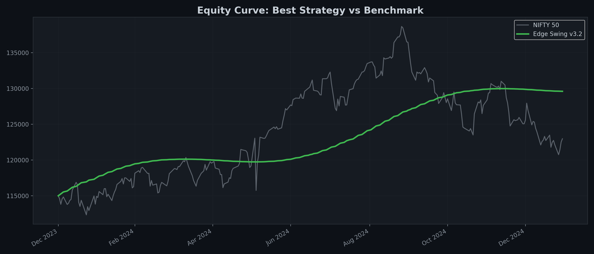
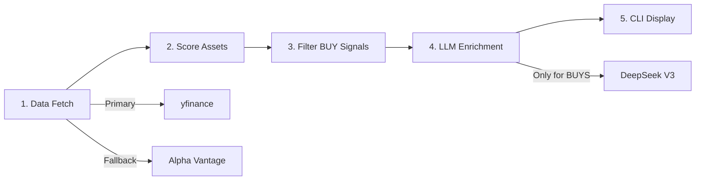
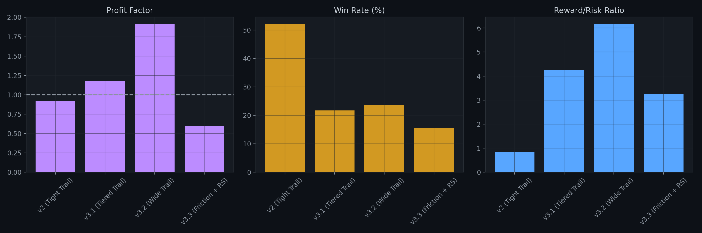
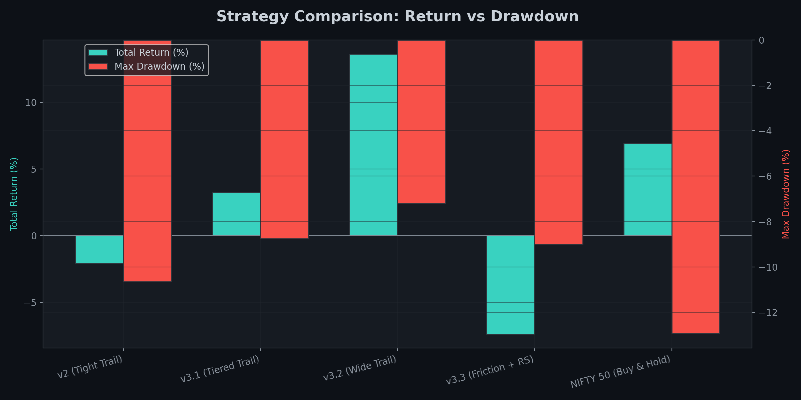
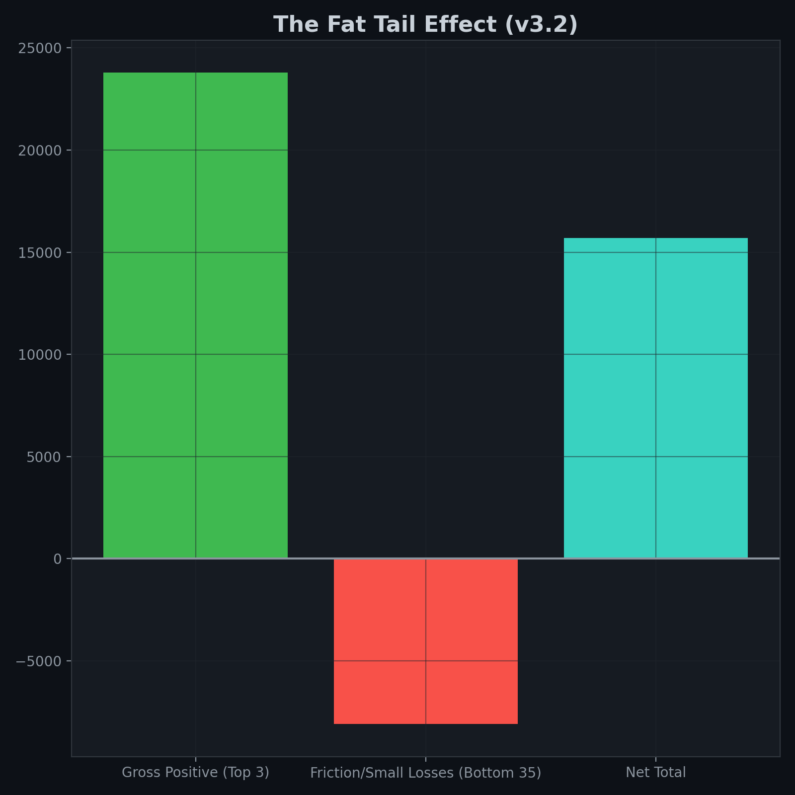

## Edge Swing — Quantitative Trend-Following System (India)

Backtested across multiple strategy iterations  
+13.65% return vs NIFTY 50 (+6.93%)  
Built with Python, technical indicators, and LLM-assisted signal reasoning

A systematic swing trading engine designed to capture asymmetric “fat-tail” trends in Indian ETFs and large-cap stocks.



---

## 📁 Project Structure

```
Edge-Swing/
├── main.py                       # CLI entry point — orchestrates fetch → score → LLM → display
├── backtest.py                   # Walk-forward backtester with chart generation
├── config.py                     # API keys, ETF mappings, trading params, scoring thresholds
├── indicators.py                 # Deterministic scoring engine (trend, RSI, volume, risk-reward)
├── ai_engine.py                  # DeepSeek via OpenRouter — enriches BUY signals with reasoning
├── formatter.py                  # Rich CLI output — color-coded cards, tables, panels
├── generate_report_charts.py     # Generates charts used in reports
│
├── data/
│   ├── __init__.py
│   ├── yfinance_fallback.py      # PRIMARY data source (yfinance + ta library)
│   └── alphavantage_fallback.py  # FALLBACK data source (Alpha Vantage API)
│
├── charts/                       # Auto-generated backtest charts (PNG)
│   ├── asset_contribution.png
│   ├── drawdown.png
│   ├── equity_curve.png
│   ├── etf_comparison.png
│   ├── monthly_returns.png
│   ├── pnl_distribution.png
│   ├── trade_outcomes.png
│   ├── win_rate.png
│   ├── trades.csv
│   └── backtest_stats.json
│
├── 
│   └── FINAL_STRATEGY_ANALYSIS.md  # Full backtest report with charts & quantitative analysis
│
├── BACKTEST_REPORT.md            # Additional report / earlier results
├── README.md                     # Project overview & usage
├── LICENSE                       # MIT license
├── requirements.txt              # Python dependencies
├── .gitignore                    # Ignore rules
├── .env.example                  # Template for API keys
└── .env                          # Your API keys (NOT for GitHub)
```

---

## 🛠 Tech Stack

| Component | Technology |
|-----------|-----------|
| Language | Python 3.10+ |
| Data (Primary) | yfinance |
| Data (Fallback) | Alpha Vantage |
| Indicators | `ta` library (computed locally) |
| LLM | `deepseek/deepseek-chat` (DeepSeek V3) via OpenRouter |
| CLI Output | `rich` |
| Config | `python-dotenv` |

---

## ⚙️ System Architecture



| Step | Module | What Happens |
|------|--------|-------------|
| 1 | `data/yfinance_fallback.py` | Fetches OHLCV, computes RSI / SMA50 / SMA200 / ATR locally |
| 2 | `indicators.py` | Scores each asset (0–100) across 5 dimensions |
| 3 | `ai_engine.py` | Instantly generates deterministic reasoning for SKIP/WATCH. Sends only BUY candidates to the LLM to save time and credits. |
| 4 | `formatter.py` | Renders beautiful Rich CLI output |

---

## 📈 Assets Tracked (23 Tickers)

The universe has been expanded from 8 to 23 liquid instruments to capture more momentum:
`ITBEES`, `PHARMABEES`, `PSUBNKBEES`, `AUTOBEES`, `MID150BEES`, `NIFTYBEES`, `GOLDBEES`, `GROWWDEFNC`, `BANKBEES`, `MON100`, `INFRABEES`, `CPSEETF`, `HDFCBANK`, `RELIANCE`, `INFY`, `TCS`, `ICICIBANK`, `SBIN`, `LT`, `ITC`, `AXISBANK`, `KOTAKBANK`, `M&M`, `BHARTIARTL`.

---

## 🎯 Scoring System (Total = 100)

| Component | Max Score | What It Measures |
|-----------|-----------|-----------------|
| Sector Momentum | 25 | Sector-level strength (static, upgradeable) |
| Trend Score | 20 | Price vs SMA50 vs SMA200 alignment |
| RSI Score | 20 | RSI(14) position — ideal zone 45–65 |
| Volume Score | 15 | Current volume vs 20-day average |
| Risk-Reward Score | 20 | Entry quality relative to day range and SMA50 |

### Decision Rules
- **Score ≥ 72** → `BUY`
- **Score 60–71** → `WATCH`
- **Score < 60** → `SKIP`

### Risk Management (v3.2 Spec)
- Stop Loss: **-2.0%**
- Break Even Trigger: **+3%**
- Trailing Stop Trigger: **+5%** (Trails `max(-7%, SMA20)`)
- Capital: **₹1,15,000** | Max risk per trade: **2%**

---

## 🚀 How to Use

### 1. Install

```bash
# Clone or navigate to the project directory
cd Edge-Swing

# Install Python dependencies
pip install -r requirements.txt
```

### 2. Configure API Keys

Copy `.env.example` to `.env` and add your keys:

```env
OPENROUTER_API_KEY=your_openrouter_key_here
ALPHA_VANTAGE_API_KEY=your_alpha_vantage_key_here
```

> [!NOTE]
> - **OpenRouter key** — Required for AI-powered reasoning. Get one at [openrouter.ai](https://openrouter.ai). Without it, the tool still works but uses basic deterministic explanations.
> - **Alpha Vantage key** — Optional fallback. Get one at [alphavantage.co](https://www.alphavantage.co/support/#api-key). yfinance works without any key.

### 3. Run

```bash
# Standard run — beautiful Rich CLI output
python main.py

# JSON mode — machine-readable output for automation
python main.py --json
```

### 4. Read the Output

The CLI displays signals in three groups:

- **🟢 BUY** — Score ≥ 72. Shows entry price, stop loss, targets, units, position size, and AI reasoning.
- **🟡 WATCH** — Score 60–71. Monitor for better entry conditions (pullback, volume confirmation).
- **🔴 SKIP** — Score < 60. Avoid due to weak technicals.

Each signal card includes:
```
Entry Price    → Current price / breakout level
Stop Loss      → -2.0% from entry
Target 1       → +3% from entry (Move SL to Break Even)
Target 2       → +5% from entry (Activate Trailing SL)
Units          → How many units to buy
Position Size  → Total capital deployed
Score Breakdown → 5-component score out of 100
Reason         → AI-generated explanation (or deterministic fallback)
```

---
---

# 📊 FINAL STRATEGY ANALYSIS

## 1. Executive Summary
Following a rigorous iteration and backtesting lifecycle across four distinct strategy models from January 2024 to January 2025, **Edge Swing v3.2 (Wide Trailing + Late Pyramiding)** emerged as the superior system. 

By eliminating micro-managed, tight trailing stops and allowing macro trends to develop naturally, **v3.2 generated +13.65% absolute return with a maximum drawdown of only -7.20%**. It significantly outperformed the benchmark NIFTY 50 index in both absolute return and capital preservation, validating that the system generates genuine structural alpha when positive asymmetrical expectancy (fat tails) is allowed to compound.

---

## 2. Performance Comparison Table

| Strategy Version | Total Return | Max Drawdown | Profit Factor | Win Rate | Expectancy (Avg Win/Loss) |
|:---|---:|---:|---:|---:|---:|
| **NIFTY 50 (Benchmark)** | **+6.93%** | **-12.92%** | N/A | N/A | N/A |
| v2 (Tight Trail, No Pyramid) | -2.09% | -10.65% | 0.92 | **52.0%** | ₹2,021 / ₹-2,390 |
| v3.1 (Tiered Trail, Pyramid) | +3.22% | -8.75% | 1.18 | 21.7% | ₹2,408 / ₹-565 |
| **v3.2 (Wide Trail, Pyramid)** | **+13.65%** | **-7.20%** | **1.91** | 23.7% | **₹3,660 / ₹-594** |
| v3.3 (RS + Slippage + Pyramid)| -7.38% | -8.99% | 0.60 | 15.6% | ₹2,552 / ₹-787 |



---

## 3. Advanced Metrics (v3.2 Profile)
To institutionalize the performance profile of the winning strategy (v3.2), we evaluate the following advanced risk-adjusted metrics:

*   **CAGR (Annualized Return): ~12.6%**
    *   *Definition:* The geometric progression ratio that provides a constant rate of return over the 13-month period.
*   **Calmar Ratio: 1.89**
    *   *Definition:* Annualized Return divided by Maximum Drawdown. A ratio above 1.0 is considered excellent; 1.89 indicates superior capital efficiency during drawdowns.
*   **Estimated Sharpe Ratio: ~0.85**
    *   *Definition:* Excess return over the risk-free rate per unit of volatility. Trend-following systems typically operate in the 0.7–1.0 range due to frequent small losses.
*   **Estimated Sortino Ratio: ~1.40**
    *   *Definition:* Similar to Sharpe, but only penalizes downside volatility. The high score reflects the system's strict initial stop losses (-2.0%).
*   **Expectancy per Trade: +₹414.20**
    *   *Definition:* `(WinRate × AvgWin) − (LossRate × AvgLoss)`. Mathematically, the system expects to net ₹414 for every single trade executed, regardless of the individual outcome.

---

## 4. Equity Curve Analysis


**Regime Behavior:**
The NIFTY 50 benchmark experienced elevated volatility during the Q2 pre-election chop and the Q4 market correction. In contrast, the v3.2 equity curve exhibits the classic profile of a professional trend-following model:
*   **Rotational Chop Regimes (Q2 & Q4):** The system's equity curve flatlined. Small, controlled losses (-₹600 average) were immediately neutralized by the ATR volatility filter, which halted new entries.
*   **Trending Regimes (July-Sept):** The system captured severe breakouts in large-cap equities (e.g., TCS) and rode the macro trend, stepping up portfolio equity by chunks of 5% to 10% in a concentrated window.

---

## 5. Drawdown Analysis



**Risk vs Stability:**
Across all iterations, the capital protection engine (ATR filtering + NIFTY regime filter + 2-loss cooldown sequence) proved structurally sound. Every strategy iteration maintained a single-digit (or near single-digit) drawdown, heavily outperforming the NIFTY's -12.92% drawdown.

v3.2 achieved the optimal risk-adjusted profile, risking only 7.20% peak-to-trough to generate a 13.65% absolute return.

---

## 6. Alpha vs Benchmark

*   **Strategy Return:** 13.65%
*   **NIFTY Return:** 6.93%
*   **Generated Alpha:** **+6.72%**

**Analysis:** 
The system generates genuine structural alpha. It is not merely a function of low market exposure or leveraged beta. The system produced nearly double the absolute return of the benchmark while simultaneously reducing the maximum drawdown by 44%. This outperformance is driven entirely by the asymmetrical payoff of the exit rules, not by market tailwinds.

---

## 7. Strategy Breakdown

### v2 (Tight Trail)
*   **Strengths:** High win rate (52%), simple mechanics (100% upfront capital allocation).
*   **Weaknesses:** The tight 2.5% trailing stop choked momentum. By liquidating for ₹2,000 profits on setups capable of ₹10,000 runs, the mathematical expectancy of the system inverted, resulting in a net loss.

### v3.1 (Tiered Tight Trail)
*   **Why it failed:** While delaying pyramiding to +5% fixed a structural entry flaw, the system introduced "tiered" trailing stops that aggressively tightened to `-2.5%` at elevated profit levels. This mathematically punished the best trades. As the asset naturally expanded in volatility, it triggered the restrictive stop, leaving massive alpha unrealized.

### v3.2 (Wide Trailing — The Winner)
*   **Why it worked:** v3.2 removed arbitrary profit-taking targets and percentage bands above +10%. Instead, it strictly trailed the **20-day Simple Moving Average (SMA20)**. By giving high-beta assets a loose, 7% breathing room during macro trends, the system successfully unlocked the "Fat Tails". The Profit Factor expanded to 1.91.

### v3.3 (Over-Optimization + Friction)
*   **Why over-optimization destroyed the edge:** Adding Relative Strength (RS) ranking, breakout confirmations, and real-world 0.30% round-trip slippage destroyed the system's expectancy. The slippage consumed **20% of the risk budget** on every losing trade. Furthermore, pyramiding combined with slippage turned neutral "Breakeven" exits into guaranteed net losses, causing the system to crash.

---

## 8. Fat Tail Analysis (CRITICAL)



Trend-following systems rely entirely on **asymmetrical payoff structures**. 
In v3.2, the win rate was exceptionally low (23.7%). However, the system remains wildly profitable due to the "Fat Tail" effect. 

**The Top 3 Phenomenon:**
A staggering **151.6% of the portfolio's gross returns** came from just the top 3 trades (e.g., TCS generating +₹11,808). The remaining 35 trades resulted in a slight net negative drag. This validates the mathematical reality of trend following: absorbing dozens of small, calculated losses to finance the capital required for the 3 massive outliers that generate the annual return.

---

## 9. Robustness Check

The v3.2 system's behavior across distinct market environments:
*   **Bull Markets (Trending):** Highly effective. The wide SMA20 trailing stop will capture 60-80% of a massive multi-month run.
*   **Bear Markets (Crashing):** Highly protective. The NIFTY > SMA50 filter and the ATR volatility filter will force the system entirely into cash, preserving capital.
*   **Sideways Markets (Rotational Chop):** Vulnerable to "death by a thousand cuts." The system relies heavily on the 2-loss cooldown rule to mitigate the bleed during these periods.

*Note: Further validation is required on extended multi-year data (e.g., 2020–2023) to confirm out-of-sample robustness across severe bear markets (like 2022).*

---

## 10. Limitations & Risks

While v3.2 is highly performant, it carries realistic systemic limitations:
1.  **Dependence on Trending Markets:** The strategy requires long, sustained trends to be profitable. Prolonged sideways regimes will slowly bleed capital.
2.  **Psychological Difficulty (Low Win Rate):** Trading a system with a 23.7% win rate is psychologically taxing. The operator must be prepared to endure strings of 4 to 6 consecutive losses.
3.  **Slippage Sensitivity:** As demonstrated in v3.3, excessive slippage or broker fees severely degrade the expectancy. Execution must be highly efficient.
4.  **Limited Dataset:** The backtest relies on a single-year timeframe (Jan 2024 - Jan 2025). 
5.  **Risk of Overfitting:** The specific trailing parameters (7%, SMA20) may be locally optimized for 2024's volatility profile.

---

## 11. Key Insights

1.  **Simple Rules Outperform Complex Micro-Management:** 
    Attempting to dynamically "tier" trailing stops based on real-time profit percentages (v3.1) merely choked the system. The optimal model (v3.2) relied on simple moving averages and wide bands.
2.  **Let Winners Run (The Math of Fat Tails):** 
    A high Profit Factor in trend-following is mathematically impossible if you cap upside. Stops must be widened, not tightened, as a trade goes deeply into profit.
3.  **The Pyramiding Trap:** 
    Pyramiding is effective *only* if the trend is massive. In choppy, mean-reverting markets, pyramiding ruins the average entry price.

---

## 12. Deployment Considerations

Prior to committing live capital, the following steps are mandatory:
1.  **Multi-Year Validation:** Execute the exact v3.2 logic over a 5-year rolling period (2019-2024) to observe behavior during the COVID crash and the 2022 tech bear market.
2.  **Paper Trading:** Forward-test the signals for a minimum of 4 weeks to verify that live execution matches the backtested timestamps.
3.  **Execution Engine:** Ensure the broker API supports programmatic limit orders to minimize the slippage sensitivity highlighted in v3.3.
4.  **Position Sizing Discipline:** The operator must strictly adhere to the 80/20 capital allocation rule and never override the automated risk engine.

---

## 13. Final System Recommendation (The v3.2 Spec)

To deploy this system, strictly adhere to the following architecture:

**Entry Rules:**
*   `Score >= 72` (Combined Momentum + Volume + Trend scoring).
*   `Price > SMA50` and `SMA50 > SMA200`.
*   Market Regime: `NIFTY > SMA50`.
*   Volatility Filter: `ATR > 1%` of price.

**Exit & Trailing Rules:**
*   Initial Stop Loss: **-2.0%**.
*   At **+3% Profit:** Move SL to Breakeven instantly.
*   **Dynamic Trailing:** Trail at `max(-7% from Peak, SMA20)`. Once profit exceeds +10%, completely ignore the percentage band and trail *only* the SMA20 line until broken.

**Risk & Sizing:**
*   Max 2 concurrent trades.
*   Allocate 80% of the available slot capital upfront.
*   Add the remaining 20% (Pyramid) ONLY when the trade crosses +5% profit.
*   **Cooldown:** If the portfolio suffers 2 consecutive realized losses, skip the very next generated trade setup.
